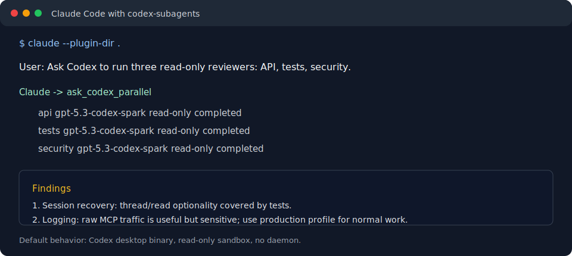

# Claude Code Codex Subagents

[](https://github.com/xuio/claude-code-codex-subagents/actions/workflows/ci.yml)
[](LICENSE)
[](package.json)

Run OpenAI Codex agents from Claude Code through a daemonless MCP plugin.

`claude-code-codex-subagents` lets Claude Code ask Codex for read-only reviews,
parallel investigations, Spark checks, native follow-ups, live steering, and
explicit full-access Codex work when the user asks for it.



## Why Use It?

- **Native Claude Code workflow:** Claude gets a small Task-like MCP surface: `codex_task`, `codex_task_group`, and `codex_followup`.
- **Read-only by default:** Codex starts with `--sandbox read-only` and non-interactive approvals.
- **No daemon:** Claude launches the MCP server over stdio for the active session.
- **Fast parallel review:** Claude can launch several independent Codex agents with bounded concurrency.
- **Persistent sessions:** App-server sessions keep Codex context across prompts and support live steering.
- **Codex desktop friendly:** The plugin prefers the Codex binary shipped inside `Codex.app` when it exists.
- **Debuggable:** Verbose JSONL logging, diagnostics bundles, progress events, and recovery hints are built in.

## Quick Start

Requirements:

- Node.js 20 or newer
- Claude Code
- Codex CLI, preferably the Codex desktop app

```sh
git clone https://github.com/xuio/claude-code-codex-subagents.git
cd claude-code-codex-subagents
npm run install:local
claude --plugin-dir .
```

Then ask Claude something like:

```text
Use Codex to review this repository read-only. Focus on reliability risks and missing tests.
```

For local development against Claude's installed plugin cache:

```sh
npm run dev:link
npm run dev:watch
```

`dev:link` symlinks Claude's local plugin install back to this working tree, so both
Claude Code CLI and the Claude Desktop bundled Claude Code binary see your changes
after `dist/index.js` is rebuilt.

## Common Workflows

### Ask One Codex Agent

```text
Ask Codex for a second opinion on the session recovery code. Keep it read-only and return concrete findings with file paths.
```

Claude should use `codex_task`.

### Run Parallel Codex Agents

```text
Launch three Codex subagents in parallel: one for API behavior, one for tests, and one for security. Keep all of them read-only.
```

Claude should use `codex_task_group` and split the work into independent tasks.

### Use Spark

```text
Use Codex Spark to do a fast focused pass on the tool descriptions.
```

Claude can pass `advanced.model: "spark"` instead of remembering the exact Spark model slug.

### Keep A Codex Session Alive

```text
Start a long-running Codex session on this repo, then let me send follow-up prompts into the same context.
```

Claude should use `codex_task` for the initial prompt, preserve the returned
`session_id`, and use `codex_followup` to continue, steer, or wait on that same
Codex context. For long first turns, Claude should set `background: true`.

## Safety Model

The default execution mode is conservative:

- `--sandbox read-only`
- `approval_policy="never"`
- prompt text sent over stdin, not argv
- secret-looking environment variables are not forwarded unless explicitly requested
- large tool responses are compacted before returning to Claude

Full local access is opt-in per call:

```json
{
  "full_access": true
}
```

Use that only when the user explicitly wants Codex to edit files, write git state,
use DNS/network, install packages, or behave like a normal unrestricted Codex run.

## Documentation

- [Usage guide](docs/USAGE.md) - tools, examples, models, sessions, env vars.
- [Architecture](docs/ARCHITECTURE.md) - process model, app-server sessions, durability, logging.
- [Development](docs/DEVELOPMENT.md) - setup, local Claude linking, test tiers, release checklist.
- [Troubleshooting](docs/TROUBLESHOOTING.md) - diagnostics, logs, common failure modes.
- [Known limitations](docs/KNOWN_LIMITATIONS.md) - sharp edges and operational constraints.
- [Release notes](docs/RELEASE.md) - current release highlights and validation.
- [Security policy](SECURITY.md) - default sandboxing, logs, reporting.
- [Contributing](CONTRIBUTING.md) - contribution expectations and local checks.

## MCP Tool Families

| Use case | Preferred tools |
| --- | --- |
| One read-only Codex task | `codex_task` |
| Several independent tasks | `codex_task_group` |
| Persistent context | `codex_task`, then `codex_followup` |
| Long-running sessions | `codex_task` with `background: true`, then `codex_followup` |
| Live steering | `codex_followup` with `mode: "steer"` |
| Diagnostics | MCP resources `codex://status`, `codex://doctor`, `codex://usage` |

Legacy tools such as `ask_codex`, `run_agent`, `run_agents`, `start_session`, and
`send_session_prompt` are hidden by default. Set
`CODEX_SUBAGENTS_ENABLE_LEGACY_TOOLS=1` only for older clients that still call the
pre-refactor names.

Debug tools such as `codex_status`, `codex_doctor`, `codex_usage_guide`,
`codex_choose_tool`, and `codex_export_debug_bundle` are hidden by default. Set
`CODEX_SUBAGENTS_ENABLE_DEBUG_TOOLS=1` only when a client needs tool-callable
diagnostics instead of the MCP diagnostic resources.

## Development

```sh
npm install
npm run build
npm run test:ci
npm run validate:plugin
```

For local install/update:

```sh
npm run install:local
npm run update:local
```

`test:ci` is portable and uses the fake Codex binary. It does not require live
Claude or Codex credentials.

Opt-in live checks are available for hardening:

```sh
npm run test:codex-runtime
npm run test:real-matrix
npm run test:claude-orchestration
npm run test:claude-real-codex
npm run test:claude-real-session
```

See [Development](docs/DEVELOPMENT.md) for the full test matrix.

## Project Status

Current release: `v0.3.0`.

This project is early, but it is already tested across:

- stdio MCP protocol flows
- fake Codex reliability and stress cases
- Codex desktop runtime probes
- app-server protocol contract checks
- Claude Code plugin validation
- opt-in real Claude Code plus real Codex end-to-end runs

The most important invariant is that routine delegation stays read-only unless the
caller explicitly opts into full local access.

## License

MIT
