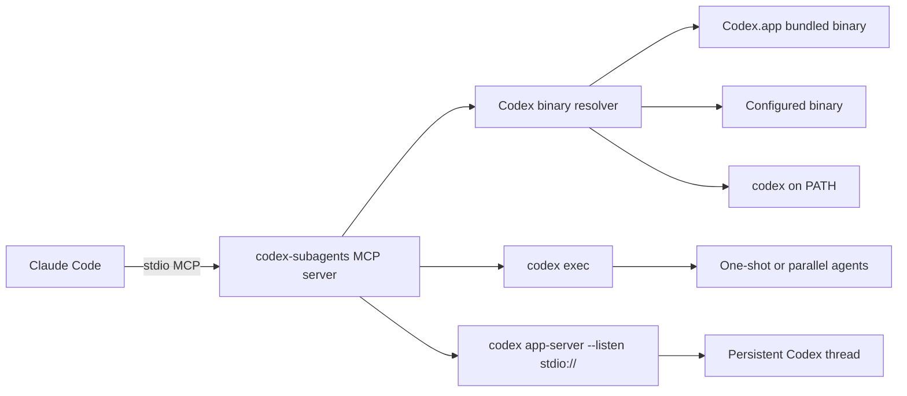

# Architecture

`claude-code-codex-subagents` is a Claude Code plugin that exposes Codex through a
stdio MCP server. Claude Code owns the MCP process lifecycle; no separate daemon
needs to be installed or supervised.

## Process Model

- Claude Code starts `dist/index.js` from the plugin manifest.
- The MCP server communicates with Claude over stdio.
- The server launches Codex child processes only when a tool call asks for work.
- One-shot tools use `codex exec`.
- Persistent sessions prefer `codex app-server --listen stdio://`.
- If app-server startup fails and fallback is allowed, session tools fall back to
  `codex exec resume`.

The app-server process is a child of the MCP server. When Claude shuts down the
MCP server, there is no background daemon left behind.

## Binary Resolution

The resolver checks candidates in this order:

1. Per-call `codex_bin`.
2. `CODEX_SUBAGENTS_CODEX_BIN`.
3. `/Applications/Codex.app/Contents/Resources/codex`.
4. `CODEX_BIN`.
5. `codex` on `PATH`.

`codex_status` reports the resolved binary and source.

## Safety Boundary

The default command line uses read-only sandboxing and non-interactive approvals.
Prompt text is sent through stdin so task bodies do not appear in the process
argument list.

Nested subagent MCP/skills/extra config is written into a temporary Codex home
instead of being exposed through argv. The temp home is removed after the run.

Full access is available only when the tool call sets
`dangerously_bypass_approvals_and_sandbox: true`.

## Sessions And Durability

Persistent sessions store resumable metadata in `CODEX_SUBAGENTS_SESSION_STATE_FILE`
or `~/.codex-subagents/sessions.json` by default. The persisted file contains
metadata needed to reattach to a Codex thread; prompt text and environment values
are not persisted.

After an MCP runtime shutdown, app-server sessions with a Codex thread id are
preserved as recoverable. `codex_session_recover` reattaches with `thread/resume`
and treats `thread/read` as an optional capability.

Async one-shot jobs are process-local and do not survive MCP restarts. Their tool
results advertise this limitation and recommend persistent sessions for recoverable
long-running work.

## Progress, Backpressure, And Retention

The server emits MCP progress notifications when the client supplies a progress
token. Long waits include heartbeat progress so Claude Code can keep the request
alive.

Global and per-project queue limits prevent Claude from flooding the MCP process.
When limits are exceeded, tools return structured recovery hints instead of
accepting unbounded work.

Completed jobs, idle sessions, and terminal sessions are pruned according to the
configured retention windows.

## Logging And Diagnostics

Verbose JSONL logging is on by default. Logs include raw MCP traffic, tool
arguments/results, progress events, queue and session lifecycle, and Codex
stdin/stdout/stderr traffic.

Diagnostic events are retained in memory and can be exported with
`codex_export_debug_bundle`. Log files and durable session state are written with
owner-only permissions.
