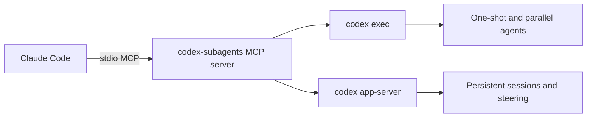

# Architecture

Claude Code starts the plugin's MCP server over stdio. The MCP server starts Codex
child processes only when a tool call asks for work.

## No Background Daemon

The plugin does not install or supervise a daemon. App-server children are owned by
the MCP server and exit with it.

## Binary Resolution

The plugin resolves Codex in this order:

1. Per-call `codex_bin`.
2. `CODEX_SUBAGENTS_CODEX_BIN`.
3. `/Applications/Codex.app/Contents/Resources/codex`.
4. `CODEX_BIN`.
5. `codex` on `PATH`.

## Durability

Persistent app-server sessions store resumable metadata and can be recovered after
an MCP runtime restart when a Codex thread id exists. Async one-shot jobs are
process-local and do not survive restart.

## Safety

Routine delegation is read-only. Full local access is explicit and scoped to a
single tool call.
